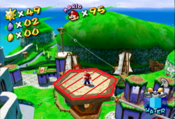

# **NicoNico Task Competition: Season 2**
This season was organized on the Japanese NicoNico Sunshine @ wiki.  
[Here is the link to the original post.](https://www49.atwiki.jp/mario-sunshine/pages/39.html)  
[Playlist of results videos](https://www.youtube.com/playlist?list=PLDQn8zHkFza_h_YBvTiHGYfP2ZYX7cqae)  

## **Task 1** 
[Results Video](https://www.youtube.com/watch?v=9DVI5sqQ6Jc) | [Original Post](https://www49.atwiki.jp/mario-sunshine/pages/40.html)  
**Level:** Delfino Plaza  
**Start:** Fade in, main spawn location (from file select or collecting Delfino shine)  
**End:** Enter one of the 7 main stages.  
Goals:  
* Collect 10 Coins  
* Bounce off one umbrella/parasol  
* Spray one yellow Yoshi forcefield with water  

## **Task 2**  
[Results Video](https://www.youtube.com/watch?v=r6ke4-yWVl8) | [Original Post](https://www49.atwiki.jp/mario-sunshine/pages/41.html)  
**Level:** Pinna 3, inside the park  
**Start:** Fade in  
**End:** Push the yellow button.  
Goal: Get 10 Points  
* Collect a Red Coin: 1pt  
* Kill a red or blue Electro-Koopa: 1pt  
* Flip a grate: 1pt

Restriction:  
* Only 1 point is awarded for each unique grate flip.  

## **Task 3**  
[Results Video](https://www.youtube.com/watch?v=9p4SyxxtBJg) | [Original Post](https://www49.atwiki.jp/mario-sunshine/pages/42.html)  
**Level:** Tall Grass Mini-Stage  
**Start:** Fade in  
**End:** The moment Mario dies  
Goals:   
* Collect 3 Red Coins  
* Stand on the leaves of a tree  
* Stand on the yellow edge of the stage  
* Kill 2 enemies. (Bird counts)

Restriction:  
* Do not stand on the edge of the stage as your last goal.  

## **Task 4**  
[Results Video](https://www.youtube.com/watch?v=4nJrJJ0imJE) | [Original Post](https://www49.atwiki.jp/mario-sunshine/pages/43.html)  
**Level:** Sirena 2/3/4/5/7/8  
**Start:** Fade in  
**End:** Grab a tree trunk.  
Goals: 
* Break 6 Barrels
* Extinguish 1 torch completely (smoke appears)
* Stand on the roof of a hut

## **Task 5**  
[Results Video](https://www.youtube.com/watch?v=zKk1vXBjYLQ) | [Original Post](https://www49.atwiki.jp/mario-sunshine/pages/44.html)  
**Level:** Ricco 8  
**Start:** Fade in  
**End:** Spawn a fruit from the Fruit Machine.  
Goals: 
* Take 2 hits of fall damage
* Collect a Rocket Nozzle
* Flip a grate

## **Task 6**  
[Results Video](https://www.youtube.com/watch?v=eE5xPVCpO38) | [Original Post](https://www49.atwiki.jp/mario-sunshine/pages/45.html)  
**Level:** Bianco 8  
**Start:** Fade in  
**End:** Complete goal  
Goal: Get 20 Points
* Kill a Pokey Sprout: 1pt
* Take fall damage: 1pt
* Kill a Pokey: 2pt
* Kill a Seedy Pod: 2pt
* Make coins appear from a circle of flowers: 2pt
* Get a nozzle (once per box): 2pt
* Clean a dirty pianta: 3pt
* Get a red coin: 3pt

## **Task 7**  
[Results Video](https://www.youtube.com/watch?v=QXiCr4xSsDo) | [Original Post](https://www49.atwiki.jp/mario-sunshine/pages/46.html)  
**Level:** Noki 6  
**Start:** Fade in  
**End:** Press the Yellow Button  
Scoring:   
Submissions are divided into two groups: one group with same or less A presses than the Manager, and one group with greater A presses.   
Each group is sorted with fastest time first, and final ranking is the entire first group, then the entire second group.  
Bonus points will be awarded, one point for each A press saved compared to the Manager.  
Restriction:  
Submission can not be longer than 40 seconds.  

## **Task 8** 
[Results Video](https://www.youtube.com/watch?v=VT-rvtmdM2g) | [Original Post](https://www49.atwiki.jp/mario-sunshine/pages/47.html)  
**Level:** Pianta 8  
**Start:** Fade in  
**End:** Break a box.  
Goals: 
* Stand on 5 Mushrooms
* Flip 2 Grates
* Get the Rocket Nozzle

Restrictions:
* Gold and Bouncy mushroom do not count

## **Task 9**
[Results Video](https://www.youtube.com/watch?v=06aoKEYT204) | [Original Post](https://www49.atwiki.jp/mario-sunshine/pages/48.html)  
**Level:** Gelato 5  
**Start:** Fade in  
**End:** The moment Mario is buried in the sand.  
Goals: Complete 4/5 of the objectives
* Get a Rocket Nozzle
* Get a Turbo Nozzle
* Spawn a coin from a Red Cataquack
* Stand on a Mirror
* Stand on the roof of the Surf Cabana

## **Task 10** 
[Results Video](https://www.youtube.com/watch?v=N19fBMeiPow) | [Original Post](https://www49.atwiki.jp/mario-sunshine/pages/49.html)  
**Level:** Sirena 7, inside the hotel  
**Start:** Fade in  
**End:** Collect a coin on the First Floor  
Goals: 
* Kill 8 Boos
* Break 1 Attic Exit

## **Task 11** 
[Results Video](https://www.youtube.com/watch?v=rvYad6cPuQg) | [Original Post](https://www49.atwiki.jp/mario-sunshine/pages/50.html)  
**Level:** Ricco 6  
**Start:** Fade in  
**End:** Press the Red Coin button  
Goals: 
* Flip 3 Grates
* Bounce off 3 unique trampolines
* Step on the Helipad

Restrictions:
* Do not run close to a transparent nozzle box
* The bouncy wheel next to the fruit machine counts
* Umbrella does not count

## **Task 12** 
[Results Video](https://www.youtube.com/watch?v=N8lapSMMgxI) | [Original Post](https://www49.atwiki.jp/mario-sunshine/pages/51.html)  
**Level:** Bianco 4  
**Start:** Fade in  
**End:** Touch the sign behind the spawn location  
Goals: 
* Collect 6 Red Coins
* Fly off a rope using the spinning animation
* Stand on this location:

1   
2   
3   
4   
5   
6   
7   

## **Task 13** 
[Results Video](https://www.youtube.com/watch?v=7tMDD4RFvXI) | [Original Post](https://www49.atwiki.jp/mario-sunshine/pages/52.html)  
**Level:** Delfino Plaza  
**Start:** Fade in, returning from any of the 7 Worlds.  
**End:** Re-enter the stage you started from.  
Goals: 
* Stand on the Rocket Nozzle platform on top of the lighthouse
* Grab the tree on the island with the Coconut lady
* Break 1 wooden box

Restriction:
* Do not use Yoshi
